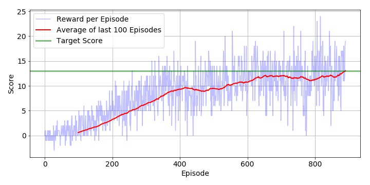

# DRLND - P1 - Navigation : Report

---

In this report, I am going to present about the environment and the algorithms that I have used to solve the navigation problem where the agent is to collect bananas.

### Environment

The project uses an environment built in Unity. The nvironment contain **_brains_** which are responsible for deciding the actions of their associated agents. Below are the characteristics of the environment.

* Unity brain name: BananaBrain
* Vector Observation space type: continuous
* Vector Observation space size (per agent): 37
* Number of stacked Vector Observation: 1
* Vector Action space type: discrete
* Vector Action space size (per agent): 4

## Learning Algorithm

### DQN

To solve this reinforment learning problem, I am using a Deep Q Network (DQN) as has been taught in the course. The agent uses replay buffer of length 10000 and a simple neural network. The agent uses **discount factor 0.99** and **learning rate 0.0005**

#### Neural Network
To approximate the value function a simple neural network  with three fully connected layers with ReLU activation function, is used.

###### Network Architecture

`` State --> 128 --> ReLU --> 128 --> ReLU --> action``

###### Pytorch Implementation 

```python
self.fc1 = nn.Linear(state_size, 128)
self.fc2 = nn.Linear(128,128)
self.fc3 = nn.Linear(128, action_size)

...

x = F.relu(self.fc1(state))
x = F.relu(self.fc2(x))
x = self.fc3(x)
```

#### Experience Replay

We store the last **10,000** experience tuples (S, A, R, S′) into a data container called **replay buffer** from which we sample **a mini-batch of 64** experiences. This batch ensures that the experiences are not highly correlated/independet and stable enough to train the network. 

```python
BUFFER_SIZE = int(1e4)  # replay buffer size
BATCH_SIZE = 64         # minibatch size
```

#### Epsilon Greedy

In order to select the next action, the agent uses epsilon-greedy policy. The agent selects an action from action space randomly with a probability of **__epsilon__**, and is reduced gradually with decay rate **0.995** with the number of iterations till it reaches **0.01**

```python
eps_start=1.0, eps_end=0.01, eps_decay=0.995  
```
  
  <br>
  
> **Parameters**
```python
BUFFER_SIZE = int(1e4)  # replay buffer size
BATCH_SIZE = 64         # minibatch size
GAMMA = 0.99            # discount factor
TAU = 1e-3              # for soft update of target parameters
LR = 5e-4               # learning rate
UPDATE_EVERY = 4        # how often to update the network```
>


## Plot of Rewards

If the agent achieves the score over 13, the problem is deemed to be solved. After tuning of the parameters, I could solve the problem in **687  episodes**. The plot below shows the rewards per episode and moving average over last 100 episodes. 



Trained model can be found [here](./data/model_weights.pth).

## Ideas for Future Work

To improve the performance, I am planning to tune hyperparameters with a grid search method and implement [Double DQN](https://arxiv.org/abs/1509.06461), [Dueling DQN](https://arxiv.org/abs/1511.06581), [Prioritized Experienced Replay](https://arxiv.org/abs/1511.05952).